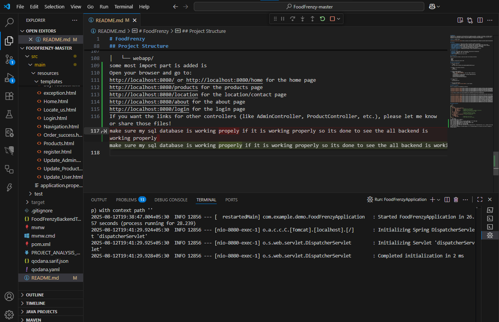
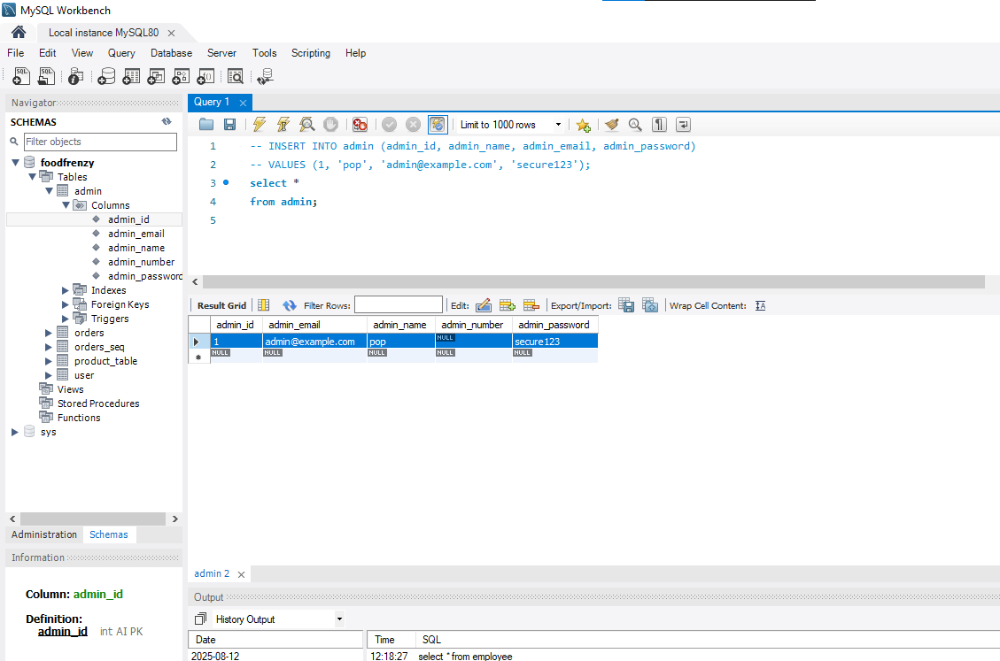
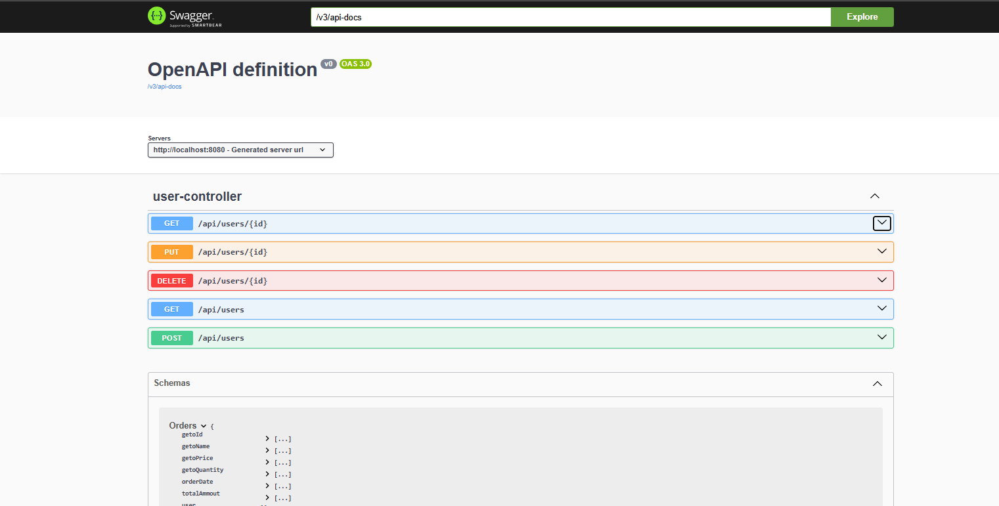

# FoodFrenzy
FoodFrenzy is a comprehensive system designed for managing customers, inventory, and orders. It offers secure authentication, role-based access control, and database integration using MySQL. Built with Spring Boot and Thymeleaf, the application provides a seamless experience for admin and staff members.

**Owner:** vinayak singh


## Features

- **Customer Management**: Easily add, update, and delete customer information.
- **Inventory Management**: Keep track of your inventory items, including stock levels and pricing.
- **Order Management**: Manage customer orders, including order creation, updates, and status tracking.
- **User Authentication**: Secure login and authentication for admin and staff members.
- **Role-Based Access Control**: Define roles and permissions for different user types.
- **Thymeleaf Templates**: Utilizes Thymeleaf for dynamic HTML templates.
- **Database Integration**: Integrated with MySQL for data storage and retrieval.

## Technology Stack

- **Backend**: Spring Boot, Java 8, Spring MVC, Spring Data JPA (Hibernate)
- **Frontend**: Thymeleaf, HTML, CSS, JavaScript
- **Database**: MySQL
- **IDE**: Eclipse, Spring Tool Suite (STS)

## Prerequisites

Before running this project, ensure you have the following installed:

- Java 8
- MySQL
- Maven
- Eclipse or Spring Tool Suite (STS)

## Setup and Installation

1. Clone the repository:
    ```bash
    git clone https://github.com/vinayaksingh369/FoodFrenzy.git
    ```

2. Navigate to the project directory:
    ```bash
    cd FoodFrenzy
    ```

3. Configure MySQL Database:
    - Create a new MySQL database.
    - Update `application.properties` with your MySQL credentials:
      ```properties
      spring.datasource.url=jdbc:mysql://localhost:3306/foodfrenzy
      spring.datasource.username=root
      spring.datasource.password=root
      spring.jpa.hibernate.ddl-auto=update
      ```

4. Run the project:
    ```bash
    mvn spring-boot:run
    ```

5. Access the application:
    - Navigate to `http://localhost:8080` in your browser. 

## Website Screenshot

Here is a preview of the FoodFrenzy interface:


 

  

 

 

 
 


## Project Structure

```bash
src/
├── main/
│   ├── java/
│   │   └── com.example.foodfrenzy/
│   │       ├── controller/      # Contains all controllers
│   │       ├── model/           # Contains entity classes
│   │       ├── repository/      # Repository interfaces for database interaction
│   │       └── service/         # Service layer with business logic
│   ├── resources/
│   │   ├── templates/           # Thymeleaf templates for views
│   │   ├── static/              # Static assets (CSS, JavaScript)
│   │   └── application.properties  # Project configuration
│   └── webapp/
│       └── WEB-INF/
│           └── views/           # Additional view files
└── test/                        # Test cases for unit testing
```
│   └── webapp/
some most import part is added is 
Open your browser and go to:
http://localhost:8080/ or http://localhost:8080/home for the home page
http://localhost:8080/products for the products page
http://localhost:8080/location for the location/contact page
http://localhost:8080/about for the about page
http://localhost:8080/login for the login page
If you want the links for other controllers (like AdminController, ProductController, etc.), please let me know or share those files!
make sure my sql database is working propely if it is working properly so its done to see the all backend is working properly 

database

1. Swagger/OpenAPI Documentation
Add a section to let users know how to access your API documentation:

## API Documentation

This project uses Swagger UI for interactive API documentation.

- After starting the backend, open [http://localhost:8080/swagger-ui.html](http://localhost:8080/swagger-ui.html) in your browser to view and test all REST APIs.


2. Postman Collection
If you have a Postman collection for backend testing:
## API Testing with Postman

A Postman collection is included for easy backend testing.  
- Import `FoodFrenzyBackendTest.postman_collection.json` into Postman.
- Run the requests to verify backend endpoints.

## Data Flow Diagram
Include the Mermaid diagram for better understanding:
## Data Flow Diagram

```mermaid
flowchart TD
    A[User (Browser)] -->|Form Submit| B[Controller]
    B -->|Calls Service| C[Service]
    C -->|Calls Repository| D[Repository]
    D -->|JPA/Hibernate| E[(MySQL Database)]
    E -->|Returns Data| D
    D -->|Returns Entity| C
    C -->|Returns Data| B
    B -->|Returns View/JSON| A

    
---

### 4. **Troubleshooting**
Add a section for common issues:
```markdown
## Troubleshooting

- **404 Whitelabel Error Page:**  
  Make sure you are using the correct URL and the backend is running.

- **Database Connection Issues:**  
  Ensure MySQL is running and your credentials in `application.properties` are correct.

- **Java Version Issues:**  
  Use Java 21 or Java 17 for compatibility with Spring Boot 3.x.

5. Contributing
Encourage others to contribute:

6. License
If you want to specify a license:

7. Acknowledgments


Let me know if you want me to add any of these sections directly to your README.md!
adding some usefull point for the project is full made by vinayak singh and guidence by q spider institute


## Table of Contents

- [Project Overview](#foodfrenzy)
- [Features](#features)
- [Technology Stack](#technology-stack)
- [Prerequisites](#prerequisites)
- [Setup and Installation](#setup-and-installation)
- [API Documentation](#api-documentation)
- [API Testing with Postman](#api-testing-with-postman)
- [Data Flow Diagram](#data-flow-diagram)
- [Troubleshooting](#troubleshooting)
- [Project Structure](#project-structure)
- [Contributing](#contributing)
- [License](#license)

---

## Repository Index

- `src/main/java/com/example/demo/controllers/`  
  Contains all Spring Boot controllers (e.g., `HomeController.java`, `UserController.java`, etc.)

- `src/main/java/com/example/demo/entities/`  
  Contains entity classes (e.g., `User.java`, `Product.java`, etc.)

- `src/main/java/com/example/demo/repositories/`  
  Contains repository interfaces for database access (e.g., `UserRepository.java`).

- `src/main/java/com/example/demo/services/`  
  Contains service classes with business logic (e.g., `UserServices.java`).

- `src/main/resources/templates/`  
  Thymeleaf HTML templates for frontend views.

- `src/main/resources/static/`  
  Static files like CSS, JavaScript, and images.

- `src/main/resources/application.properties`  
  Main configuration file for Spring Boot and database.

- `README.md`  
  Project documentation and instructions.

- `pom.xml`  
  Maven build and dependency configuration.

---

## Acknowledgments

This project is fully made by **vinayak singh** with guidance from Q Spider Institute.